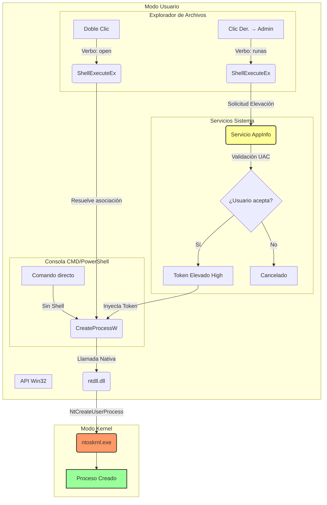

1.  **CMD no es "raro", es "directo":** `cmd.exe` no es una excepción extraña; es el comportamiento estándar de un programa creando otro programa. `ShellExecute` es quien añade "magia" (asociaciones, verbos, UAC).
2.  **El nombre de la función Kernel:** En Windows moderno (Vista en adelante), la función nativa es **`NtCreateUserProcess`**. `NtCreateProcess` es más antigua y se usa menos para aplicaciones de usuario.
3.  **La elevación (Admin) no es solo `ShellExecute`:** Cuando eliges "Ejecutar como administrador", `ShellExecute` no puede simplemente llamar a `CreateProcess`. Debe hablar con el servicio **AppInfo** (vía RPC) para obtener un token elevado antes de llamar a `CreateProcess`.

### ✅ Correcciones Breves

| Tu afirmación | Matiz Técnico |
| :--- | :--- |
| *"CMD es un caso raro"* | CMD usa la vía **estándar** (`CreateProcess`). `ShellExecute` es la capa extra de inteligencia del Explorador. |
| *"Todo acaba en NtCreateProcess"* | Técnicamente es **`NtCreateUserProcess`** en sistemas modernos. |
| *"Abrir como admin es igual pero con permisos"* | No es igual. Interviene el **servicio AppInfo** para cambiar el token antes de crear el proceso. |
| *"Abrir un archivo"* | Técnicamente abres la **aplicación asociada** pasándole el archivo como argumento. |

---

### 🗺️ Diagrama de Flujo Unificado

Aquí ves cómo convergen los caminos hacia el Kernel.

---

### 📝 Explicación del Diagrama

1.  **Línea Verde (Doble Clic):**
    *   `Explorer` → `ShellExecute` → Busca en Registro qué app abre el archivo → `CreateProcess` → **Kernel**.
    *   *Token:* Heredado (Medium).

2.  **Línea Naranja (Ejecutar como Admin):**
    *   `Explorer` → `ShellExecute("runas")` → **Servicio AppInfo** → **UAC** → Token Elevado → `CreateProcess` → **Kernel**.
    *   *Token:* Elevado (High). Aquí hay un salto de seguridad.

3.  **Línea Azul (CMD):**
    *   `CMD` → `CreateProcess` → **Kernel**.
    *   *Token:* Heredado (Lo que tenga el CMD). Sin intermediarios.

### 🎯 Conclusión Final

**Todas las rutas civiles terminan en el mismo puerto del kernel (`NtCreateUserProcess`)**. La diferencia está en **quién prepara el equipaje** (el token de seguridad) antes de subir al barco.

*   **CMD:** Sube con lo que lleva puesto.
*   **Doble Clic:** El Explorador le busca la ropa adecuada (asociación).
*   **Admin:** El Explorador pide permiso al jefe de seguridad (AppInfo) para darle un traje blindado (Token High).
