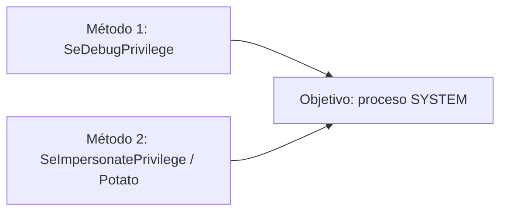
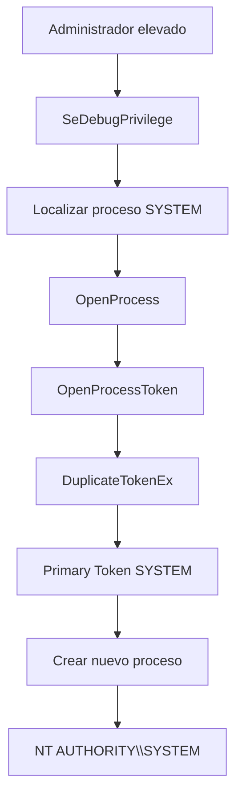
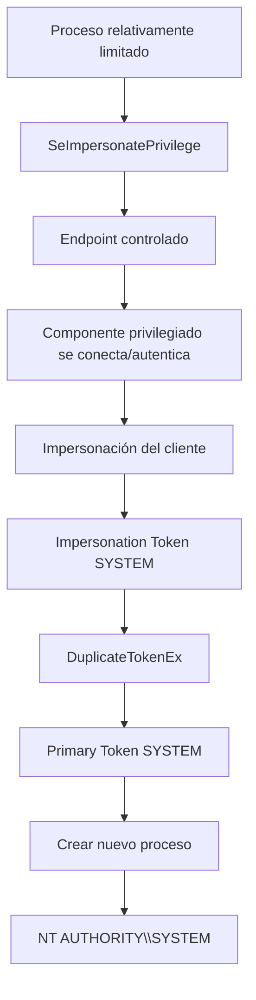
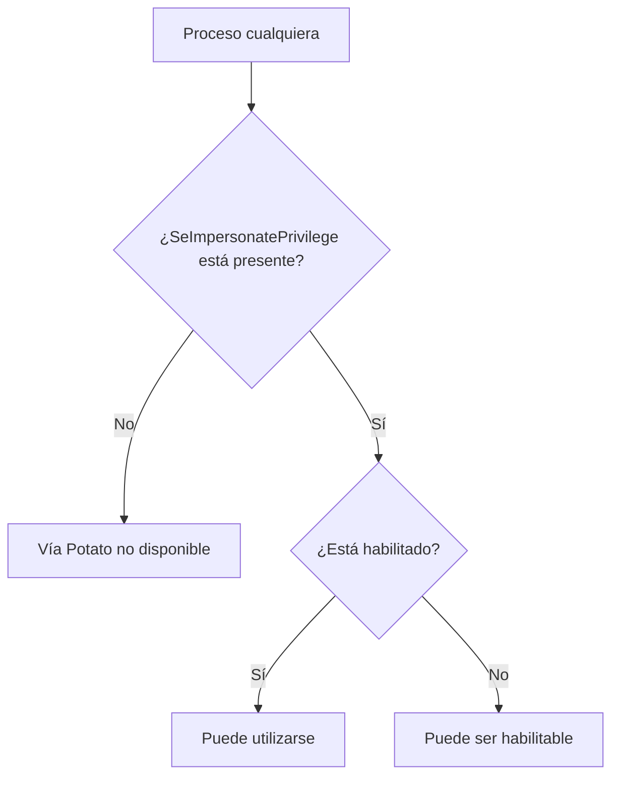
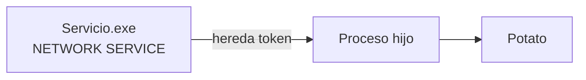

# Token Stealing en Windows
x
## Objetivo general

En los escenarios estudiados, el objetivo habitual es conseguir ejecutar un proceso con un token asociado a:

```text
NT AUTHORITY\SYSTEM
```

`SYSTEM` es una de las identidades más privilegiadas de Windows a nivel local. No representa poder absoluto sobre todo el sistema —siguen existiendo mecanismos como kernel/Ring 0, procesos protegidos y otros controles—, pero en una escalada de privilegios local suele ser uno de los objetivos principales.

Si una terminal devuelve:

```text
whoami
nt authority\system
```

significa que ese proceso está ejecutándose con un token asociado a `NT AUTHORITY\SYSTEM`.

---

## Cuentas de servicio

Una **cuenta de servicio** es una identidad utilizada por Windows para ejecutar servicios y procesos en segundo plano. No está pensada necesariamente para que una persona inicie sesión de forma interactiva.

Ejemplos habituales:

- `NT AUTHORITY\LOCAL SERVICE`: relativamente restringida.
- `NT AUTHORITY\NETWORK SERVICE`: limitada localmente, aunque puede autenticarse en red usando la identidad del equipo en determinados contextos.
- `NT AUTHORITY\SYSTEM` / `LocalSystem`: extremadamente privilegiada localmente.
- cuentas específicas creadas para IIS, SQL Server, agentes, backups u otros servicios.

> **Cuenta de servicio ≠ SYSTEM necesariamente.**

Una cuenta de servicio puede ser limitada o extremadamente privilegiada dependiendo de su identidad y del token que tenga asociado.

---

# Dos escenarios principales

Los dos caminos estudiados buscan prácticamente lo mismo:

```text
nuevo proceso
    ↓
token NT AUTHORITY\SYSTEM
```

La diferencia principal está en **cómo conseguimos el token privilegiado**.



---

## Método 1 — Token stealing directo con `SeDebugPrivilege`

En este escenario partimos normalmente de un **administrador elevado** cuyo token contiene `SeDebugPrivilege`.

El administrador ya tiene muchos permisos, pero buscamos ejecutar un proceso bajo la identidad `NT AUTHORITY\SYSTEM`.

### Idea mental

> **Voy directamente a buscar un token SYSTEM que ya existe.**

### Flujo conceptual



En forma resumida:

```text
Administrador elevado
        ↓
SeDebugPrivilege
        ↓
abrir proceso SYSTEM
        ↓
abrir su token
        ↓
duplicarlo
        ↓
crear un nuevo proceso
        ↓
NT AUTHORITY\SYSTEM
```

### Papel de `SeDebugPrivilege`

`SeDebugPrivilege` tiene especial importancia en la barrera inicial: **abrir procesos privilegiados a los que normalmente no tendríamos acceso**.

No "activa" `OpenProcessToken()`. Las APIs existen siempre. Lo que cambia es si Windows concede los accesos solicitados.

El modelo correcto es:

```text
SeDebugPrivilege
        ↓
OpenProcess() sobre proceso privilegiado
        ↓
HANDLE válido al proceso
        ↓
OpenProcessToken()
        ↓
HANDLE al token con los derechos concedidos
```

Los derechos solicitados sobre el proceso y los derechos solicitados sobre el token son cosas diferentes.

Por ejemplo, sobre el token pueden solicitarse permisos como:

- `TOKEN_QUERY`
- `TOKEN_DUPLICATE`
- `TOKEN_ASSIGN_PRIMARY`

Una vez el token puede duplicarse, `DuplicateTokenEx()` permite obtener un token apropiado para utilizarlo en la creación de otro proceso.

---

# Método 2 — Potato / `SeImpersonatePrivilege`

Potato parte normalmente de otro escenario.

En lugar de poder abrir directamente procesos SYSTEM mediante `SeDebugPrivilege`, tenemos un proceso cuyo token contiene:

```text
SeImpersonatePrivilege
```

Ese proceso puede pertenecer a:

- `LOCAL SERVICE`
- `NETWORK SERVICE`
- una cuenta específica de un servicio
- cualquier otro contexto cuyo token incluya ese privilegio

Lo importante **no es que sea literalmente un servicio**, sino que el token efectivo del proceso contenga `SeImpersonatePrivilege`.

### Idea mental

> **En lugar de ir yo a buscar el token de SYSTEM, hago que un contexto privilegiado venga hacia mí y entonces lo impersono.**

### Flujo conceptual



En forma resumida:

```text
Proceso limitado
        ↓
SeImpersonatePrivilege
        ↓
conseguir conexión/autenticación privilegiada
        ↓
impersonar al cliente SYSTEM
        ↓
Impersonation Token SYSTEM
        ↓
duplicar como Primary Token
        ↓
crear nuevo proceso
        ↓
NT AUTHORITY\SYSTEM
```

---

## Qué ocurre realmente durante la impersonación

La impersonación **no sustituye automáticamente el Primary Token del proceso completo**.

Cuando un hilo impersona a un cliente:

```text
Proceso
→ mantiene su Primary Token original

Hilo impersonado
→ recibe un Impersonation Token
→ actúa temporalmente con la identidad del cliente
```

Por eso es importante distinguir:

### Primary Token

Es el token principal asociado a un proceso.

### Impersonation Token

Es un token que puede asociarse a un hilo para que ese hilo actúe temporalmente con otra identidad.

Para crear un nuevo proceso bajo esa identidad, normalmente se obtiene el token del hilo y se duplica como `TokenPrimary`.

```text
Impersonation Token SYSTEM
        ↓
DuplicateTokenEx(... TokenPrimary ...)
        ↓
Primary Token SYSTEM
        ↓
nuevo proceso SYSTEM
```

> **Impersonar permite que un hilo actúe temporalmente como el cliente; duplicar ese token como Primary Token permite materializar esa identidad en un proceso nuevo.**

---

# ¿Por qué Potato aparece tanto con cuentas de servicio?

Porque muchas cuentas de servicio pueden encontrarse en una situación especialmente interesante:

```text
No son administradores
No son SYSTEM
No tienen SeDebugPrivilege
        ↓
pero
        ↓
pueden tener SeImpersonatePrivilege
```

Eso permite que una identidad aparentemente limitada pueda convertirse en un punto de partida para una escalada.

Ejemplo conceptual:

```text
LOCAL SERVICE / NETWORK SERVICE
        ↓
permisos relativamente limitados
        ↓
SeImpersonatePrivilege presente
        ↓
Potato
        ↓
SYSTEM
```

No debe asumirse que todas las cuentas de servicio tengan este privilegio. Lo correcto es comprobar el token real del proceso.

---

# ¿Tiene que empezar Potato desde un servicio?

No.

La condición realmente importante es:

```text
¿El token del proceso contiene SeImpersonatePrivilege?
```



Un proceso **no puede añadir arbitrariamente un privilegio que no existe en su token**.

Regla práctica:

- presente y habilitado → puede utilizarse;
- presente pero deshabilitado → puede ser posible habilitarlo;
- ausente → no puede añadirse simplemente mediante `AdjustTokenPrivileges`.

Potato tampoco "regala" `SeImpersonatePrivilege`: debe empezar ejecutándose desde un contexto cuyo token ya lo posea.

---

# Relación con servicios vulnerables

Un escenario típico puede ser:

```text
Servicio vulnerable
        ↓
ejecución de código en su contexto
        ↓
el proceso creado hereda su token
        ↓
ese token contiene SeImpersonatePrivilege
        ↓
Potato puede resultar relevante
```

No hace falta imaginar necesariamente una CMD abierta manualmente como cuenta de servicio. Lo importante es **tener ejecución de código dentro de un proceso que ya utiliza ese token**.

Si ese servicio crea un proceso hijo, el hijo puede heredar el contexto de seguridad del servicio.



---

# Dos casos distintos al comprometer un servicio

## Servicio ejecutándose como `LocalSystem`

Si el servicio ya corre como:

```text
LocalSystem
```

su identidad corresponde esencialmente a:

```text
NT AUTHORITY\SYSTEM
```

Por tanto:

```text
Servicio LocalSystem
        ↓
ejecución en su contexto
        ↓
ya somos SYSTEM
```

En ese escenario no tendría sentido utilizar Potato para escalar a SYSTEM: **el objetivo ya está conseguido**.

## Servicio ejecutándose como `LocalService` o `NetworkService`

Aquí el punto de partida es diferente:

```text
LOCAL SERVICE / NETWORK SERVICE
        ↓
contexto limitado
        ↓
SeImpersonatePrivilege presente
        ↓
Potato
        ↓
impersonación de SYSTEM
        ↓
nuevo proceso SYSTEM
```

Este es el tipo de situación donde las técnicas Potato tienen especial interés.

---

# Enumeración conceptual de servicios

Para estudiar qué servicios existen y bajo qué identidad se ejecutan, puede consultarse información del sistema como:

```powershell
Get-CimInstance Win32_Service |
    Select-Object Name, StartName, State
```

El campo más relevante en este análisis es `StartName`, porque indica con qué identidad está configurado el servicio.

Ejemplo conceptual:

```text
Name             StartName                         State
----             ---------                         -----
Audiosrv         NT AUTHORITY\LocalService         Running
AppHostSvc       LocalSystem                       Running
OtroServicio     NT AUTHORITY\NetworkService       Running
```

Esto permite distinguir rápidamente servicios que ya ejecutan como SYSTEM de servicios que utilizan identidades más limitadas.

---

# Comparación final

| Característica | Método directo | Potato |
|---|---|---|
| Privilegio clave | `SeDebugPrivilege` | `SeImpersonatePrivilege` |
| Punto de partida típico | Administrador elevado | Proceso/servicio más limitado |
| Forma de conseguir SYSTEM | Abrir un proceso SYSTEM y acceder a su token | Conseguir una conexión privilegiada e impersonarla |
| Token intermedio | Token abierto desde otro proceso | Impersonation Token del hilo |
| Paso final | Duplicar/usar token para crear proceso | Duplicar como Primary Token y crear proceso |
| Objetivo | `NT AUTHORITY\SYSTEM` | `NT AUTHORITY\SYSTEM` |

---

# Regla mental para recordarlo

```text
MÉTODO 1 — SeDebugPrivilege

"Voy yo a buscar el token de SYSTEM"

Administrador elevado
        ↓
abrir proceso SYSTEM
        ↓
abrir token
        ↓
duplicar
        ↓
proceso SYSTEM
```

```text
MÉTODO 2 — Potato / SeImpersonatePrivilege

"Hago que SYSTEM venga hacia mí y lo impersono"

Proceso limitado
        ↓
SeImpersonatePrivilege
        ↓
conexión privilegiada
        ↓
impersonación
        ↓
duplicar token
        ↓
proceso SYSTEM
```

## Conclusión

Los dos métodos persiguen esencialmente el mismo resultado, pero parten de capacidades distintas.

- Con `SeDebugPrivilege`, el enfoque consiste en **acceder directamente a un proceso privilegiado y trabajar con su token**.
- Con `SeImpersonatePrivilege`, el enfoque consiste en **aprovechar una autenticación/conexión privilegiada y actuar temporalmente con la identidad del cliente**.

La parte específica de cada variante Potato está principalmente en **cómo consigue provocar esa conexión privilegiada inicial**. Esa fase depende de la variante concreta, de la versión de Windows y de los componentes disponibles; no debe asumirse que siempre funcionará.

> **Resumen definitivo:** `SeDebugPrivilege` = voy al token de SYSTEM. `SeImpersonatePrivilege` = consigo que SYSTEM venga hacia mí y lo impersono.
