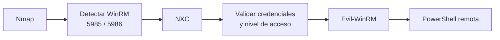
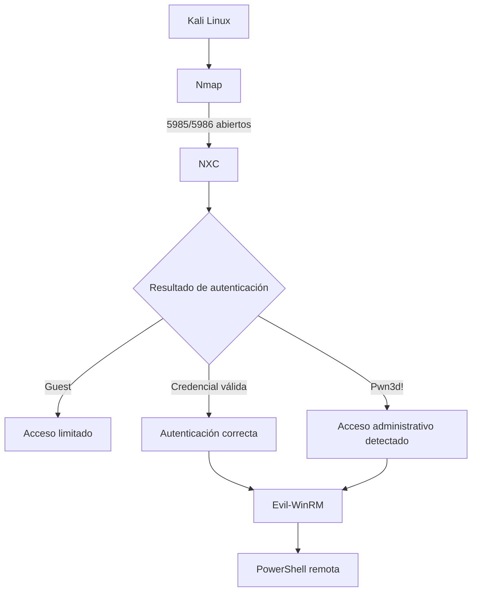
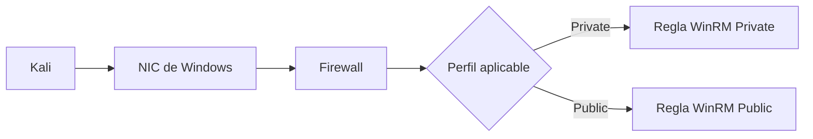
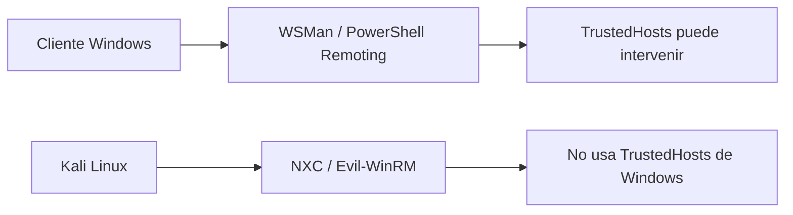

# NXC (NetExec): contexto, propósito y flujo con WinRM

Este archivo sirve como visión general de **NXC / NetExec** dentro de un flujo de trabajo de laboratorio con **WinRM**. La idea principal es entender qué papel cumple NXC, qué información aporta y por qué no sustituye a herramientas como Evil-WinRM.

> Uso previsto: laboratorio propio, CTF o entornos donde exista autorización explícita.

---

## 1. Idea principal

**NXC no sustituye a Evil-WinRM.**

NXC encaja normalmente **antes** porque está pensado para **descubrir, comprobar, validar y automatizar** pruebas sobre uno o varios hosts. Evil-WinRM está más orientado a abrir una **PowerShell interactiva** cuando ya sabemos que WinRM está disponible y tenemos unas credenciales válidas.



La forma más fácil de recordarlo:

- **Nmap** → descubre el servicio.
- **NXC** → comprueba si podemos autenticarnos y qué nivel de acceso tenemos.
- **Evil-WinRM** → abre una shell interactiva.

---

## 2. Qué aporta NXC

NXC es especialmente útil para:

- comprobar si un servicio remoto responde;
- validar credenciales;
- identificar rápidamente el nombre del host y otra información básica;
- distinguir entre una autenticación limitada y un acceso administrativo;
- trabajar con varios hosts de forma automatizada;
- utilizar diferentes protocolos, no solamente WinRM.

Ejemplo sencillo:

```bash
nxc winrm 192.168.56.1 -u Eduardo -p '123'
```

En un laboratorio, NXC puede devolver información como:

```text
WINRM  192.168.56.1  5985  PCEDUARDO  [+] PCEDUARDO\Eduardo:123 (Pwn3d!)
```

Esto nos dice que:

1. WinRM está accesible.
2. Las credenciales son aceptadas.
3. NXC ha detectado privilegios administrativos suficientes sobre ese host/servicio.

---

## 3. Guest, credencial válida y Pwn3d!

Conviene no memorizar una equivalencia incorrecta.

### Guest

Si una sesión acaba apareciendo como **Guest**, significa que Windows está tratando esa autenticación como una sesión de invitado o de acceso limitado.

```text
Guest
→ sesión limitada / invitado
```

No significa simplemente "usuario normal".

### Credencial válida sin Pwn3d!

Una cuenta puede autenticarse correctamente sin que NXC detecte privilegios administrativos.

```text
Credencial válida
→ autenticación correcta
→ no implica administración
```

### Pwn3d!

Cuando NXC muestra:

```text
Pwn3d!
```

indica que ha detectado **acceso administrativo suficiente** en ese contexto.

```text
Pwn3d!
→ acceso administrativo detectado
```

---

## 4. NXC frente a Evil-WinRM

### NXC

Piensa en NXC como una herramienta de **validación, enumeración y automatización**.

```text
NXC
→ descubrir
→ comprobar
→ validar
→ enumerar
→ automatizar
→ trabajar con varios hosts
```

### Evil-WinRM

Piensa en Evil-WinRM como una herramienta para **trabajar dentro de una sesión WinRM**.

```text
Evil-WinRM
→ conectar
→ PowerShell interactiva
→ trabajar manualmente en un host concreto
```

Ejemplo:

```bash
evil-winrm -i 192.168.56.1 -u Eduardo -p '123'
```

Resultado esperado:

```text
*Evil-WinRM* PS C:\Users\Eduardo\Documents>
```

---

## 5. Flujo mental completo



---

## 6. Nmap antes de NXC

Antes de utilizar NXC suele ser útil identificar si WinRM está escuchando.

```bash
nmap -Pn -p 5985,5986 192.168.56.1
```

Puertos habituales:

```text
5985/TCP → WinRM HTTP
5986/TCP → WinRM HTTPS
```

Flujo:

```text
Nmap
  ↓
¿5985/5986 abiertos?
  ↓
NXC
  ↓
¿credenciales válidas?
  ↓
Evil-WinRM
  ↓
PowerShell
```

---

## 7. Public / Private y WinRM

El perfil **Public / Private** pertenece al lado Windows y afecta principalmente a qué reglas de **Windows Defender Firewall** se aplican.

```text
Public
→ red menos confiable
→ reglas más restrictivas

Private
→ red considerada de confianza
→ pueden aplicarse reglas Private
```

Esto no cambia la ruta de los paquetes y tampoco convierte automáticamente todas las NIC en privadas.



En el laboratorio que dio origen a estas notas, la regla activa de WinRM era:

```text
Administración remota de Windows (HTTP de entrada)
Enabled   : True
Profile   : Domain, Private
Direction : Inbound
Action    : Allow
```

Mientras que la regla equivalente para `Public` estaba deshabilitada. Por eso cambiar el perfil de red modificaba si WinRM era alcanzable desde Kali.

**Importante:** que una prueba funcione al poner una red como Private no demuestra que todos los demás adaptadores hayan pasado automáticamente a Private.

---

## 8. TrustedHosts

`TrustedHosts` es un concepto diferente de Public/Private.

```text
Public / Private
→ perfil de red y firewall

TrustedHosts
→ confianza del cliente WinRM de Windows
```

Puede ser necesario en determinados escenarios cuando un **cliente Windows** utiliza WSMan/PowerShell Remoting y no puede validar el servidor mediante Kerberos.

Ejemplo en Windows:

```powershell
Set-Item WSMan:\localhost\Client\TrustedHosts -Value "192.168.56.1"
```

Pero desde Kali con NXC o Evil-WinRM **no se utiliza el almacén `TrustedHosts` del cliente Windows**.



---

## 9. Comandos básicos de referencia

### Descubrir WinRM

```bash
nmap -Pn -p 5985,5986 192.168.56.1
```

### Validar credenciales con NXC

```bash
nxc winrm 192.168.56.1 -u Eduardo -p '123'
```

### Abrir PowerShell con Evil-WinRM

```bash
evil-winrm -i 192.168.56.1 -u Eduardo -p '123'
```

### Ver las NIC en Windows

```powershell
Get-NetAdapter
```

### Ver las IPv4 de cada interfaz

```powershell
Get-NetIPAddress -AddressFamily IPv4 |
Format-Table InterfaceIndex,InterfaceAlias,IPAddress
```

### Ver perfiles Public / Private / Domain

```powershell
Get-NetConnectionProfile
```

### Cambiar una conexión a Private

```powershell
Set-NetConnectionProfile -InterfaceIndex 2 -NetworkCategory Private
```

### Cambiarla de nuevo a Public

```powershell
Set-NetConnectionProfile -InterfaceIndex 2 -NetworkCategory Public
```

---

# Chuleta final

```text
Nmap
→ ¿existe WinRM?

NXC
→ ¿funcionan las credenciales?
→ ¿qué nivel de acceso tengo?
→ automatización / enumeración

Guest
→ sesión invitado / limitada

Credencial válida
→ autentica, pero no implica admin

Pwn3d!
→ NXC detecta acceso administrativo

Evil-WinRM
→ PowerShell interactiva

Public / Private
→ perfil del firewall del servidor Windows

TrustedHosts
→ configuración del cliente WinRM de Windows
→ Kali + NXC/Evil-WinRM no depende de ella
```

## Frase para recordar

> **NXC comprueba y clasifica el acceso; Evil-WinRM aprovecha unas credenciales válidas para abrir una PowerShell interactiva.**
